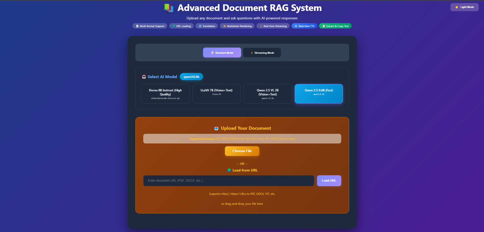
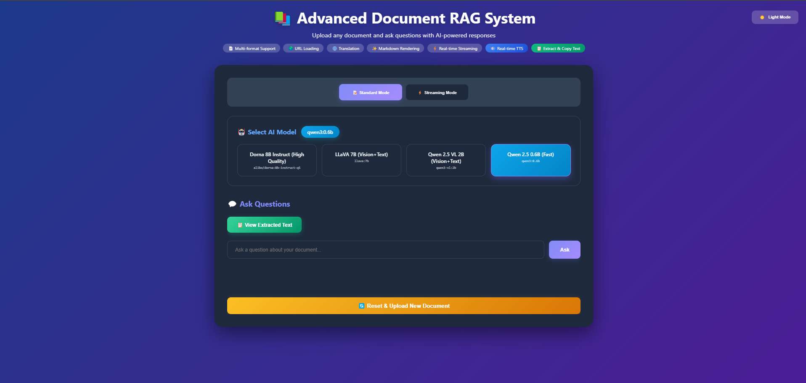

# 📚 Advanced Document RAG System with Real-time TTS

A powerful Retrieval-Augmented Generation (RAG) system that leverages advanced OCR and text extraction with Docling to enable intelligent document analysis with AI-powered question answering, multi-language translation, and real-time text-to-speech capabilities.


*Document upload and model selection interface*


*Interactive question-answering with translation and TTS features*

## ✨ Features

### 🔍 Intelligent Document Processing
- **Multi-format Support**: PDF, DOCX, PPTX, XLSX, TXT, MD, HTML, RTF, ODT, CSV, and all images format
- **URL Loading**: Direct document loading from web URLs
- **Advanced Text Extraction**: Powered by [Docling](https://github.com/docling-project/docling) for accurate text extraction from complex documents
- **Vector Search**: Uses ChromaDB with multilingual embeddings for semantic search
- **Text Extraction View**: View and copy the complete extracted markdown text from your documents

### 🤖 Multiple AI Model Support
Choose from various pre-configured models:
- **Qwen 2.5 0.6B** - Fast, lightweight model for quick responses
- **Qwen 2.5 VL 2B** - Vision + Text multimodal capabilities
- **LLaVA 7B** - Advanced vision-language model
- **Dorna 8B Instruct** - High-quality multilingual responses (best for persian answer)

**Run Your Own Models**: Easily add any Ollama-compatible model to the system!

### 💬 Smart Q&A System
- **Standard Mode**: Get complete, formatted answers instantly
- **Streaming Mode**: Real-time token-by-token response generation
- **Markdown Rendering**: Beautiful formatting with code highlighting
- **Source Citations**: View relevant document excerpts used for answers

### 🌍 Multi-language Translation
Translate answers to 12+ languages:
- Persian (فارسی)
- Spanish (Español)
- French (Français)
- Chinese (中文)
- German (Deutsch)
- Japanese (日本語)
- Arabic (العربية)
- Russian (Русский)
- Portuguese (Português)
- Italian (Italiano)
- Korean (한국어)
- Hindi (हिन्दी)

### 🔊 Real-time Text-to-Speech
- **Streaming TTS**: Hear answers as they're generated using Kokoro TTS
- **Multi-language Support**: 8 languages including English, Spanish, French, Chinese, Japanese, Hindi, Italian, and Portuguese
- **Audio Visualizer**: Real-time visual feedback during playback
- **WebSocket Streaming**: Low-latency audio delivery
- **Voice Selection**: High-quality voice synthesis with adjustable speed

### 🎨 Modern UI/UX
- **Dark/Light Theme**: Toggle between themes with persistent preference
- **Responsive Design**: Works seamlessly on desktop and mobile
- **Drag & Drop**: Easy file upload with drag-and-drop support
- **Real-time Feedback**: Loading indicators and status messages
- **Copy to Clipboard**: Quickly copy answers and extracted text

## 🛠️ Technology Stack

### Backend
- **Flask**: Web framework with SocketIO for WebSocket support
- **Docling**: Advanced document parsing and text extraction
- **LangChain**: RAG pipeline orchestration
- **ChromaDB**: Vector database for semantic search
- **Ollama**: Local LLM inference engine
- **HuggingFace Embeddings**: Multilingual text embeddings [(intfloat/multilingual-e5-small)](https://huggingface.co/intfloat/multilingual-e5-small) (you can use the other model)
- **Kokoro TTS**: High-quality streaming text-to-speech with PyTorch backend

### Frontend
- **Vanilla JavaScript**: Fast, dependency-free frontend
- **Socket.IO**: Real-time WebSocket communication
- **Marked.js**: Markdown rendering
- **Highlight.js**: Code syntax highlighting
- **Web Audio API**: Advanced audio processing and playback

## 📋 Prerequisites

- Python 3.8+
- Ollama installed locally
- PyTorch (for Kokoro TTS)
- 4GB+ RAM (8GB+ recommended for larger models)
- Modern web browser with Web Audio API support

## 🚀 Installation

### 1. Clone the Repository
```bash
git clone https://github.com/SajjadMahmoudi/Advanced-Document-RAG-System.git
cd Advanced-Document-RAG-System
```

### 2. Install Python Dependencies
```bash
# Core dependencies
pip install flask flask-socketio werkzeug docling langchain langchain-community chromadb sentence-transformers requests

# TTS dependencies
pip install torch kokoro-onnx numpy
```

### 3. Install Ollama
Visit [Ollama.ai](https://ollama.ai) and follow installation instructions for your OS.

### 4. Pull AI Models
```bash
# Pull default models
ollama pull qwen3:0.6b
ollama pull qwen3-vl:2b
ollama pull llava:7b
ollama pull alibo/dorna:8b-instruct-q5

# Or pull your preferred models
ollama pull <model-name>
```

## 📁 Project Structure

```
advanced-rag-system/
│
├── app.py                  # Main Flask application
├── TTS.py                  # Kokoro TTS streaming processor
├── templates/
│   └── index.html         # Frontend interface
├── requirements.txt       # Python dependencies
└── README.md             # This file
```

## 🎯 Usage

### Start the Server
```bash
python app.py
```

The application will be available at `http://localhost:5000`

### Using the System

1. **Select AI Model**: Choose your preferred model from the model selector
2. **Upload Document**: 
   - Click "Choose File" or drag & drop a document
   - Or enter a URL to load a document from the web
3. **View Extracted Text** (Optional): Click "View Extracted Text" to see the markdown extraction
4. **Ask Questions**: Type your question in the input field
5. **Choose Response Mode**: Standard for complete answers, Streaming for real-time generation
6. **Translate** (Optional): Select a target language and click "Translate"
7. **Listen** (Optional): Select TTS language and click "Read Aloud"
8. **Copy**: Use copy buttons to save answers or extracted text to clipboard

## 🔧 Configuration

### Adding Custom Models

Edit the `AVAILABLE_MODELS` dictionary in `app.py`:

```python
AVAILABLE_MODELS = {
    'your-model:tag': 'Your Model Display Name',
    'mistral:7b': 'Mistral 7B',
    'llama2:13b': 'Llama 2 13B',
    # Add any Ollama-compatible model
}
```

Then pull the model:
```bash
ollama pull your-model:tag
```

### Customizing Chunk Size

Adjust document chunking in `app.py`:

```python
text_splitter = RecursiveCharacterTextSplitter(
    chunk_size=1000,      # Adjust chunk size
    chunk_overlap=200,    # Adjust overlap
    length_function=len
)
```

### TTS Configuration

Customize TTS settings in `TTS.py`:

```python
class StreamingTTSProcessor:
    def __init__(self, lang_code='b'):
        self.pipeline = KPipeline(lang_code=lang_code)
        self.sample_rate = 24000  # Adjust sample rate
        
    def stream_speech(self, text, voice='af_heart', speed=1.0):
        # voice: Voice model selection
        # speed: Speech speed (0.5 = slow, 2.0 = fast)
```

### Adding More Languages

For translation, add to `language_prompts` in `app.py`:
```python
language_prompts = {
    'your_language': 'Language Name (Native Name)',
    # ...
}
```

For TTS, update `LANGUAGE_TO_TTS` mapping in `app.py`:
```python
LANGUAGE_TO_TTS = {
    'your_language': 'tts_code',  # Kokoro language code
    # Available: 'a' (American), 'b' (British), 'e' (Spanish),
    #            'f' (French), 'h' (Hindi), 'i' (Italian),
    #            'p' (Portuguese), 'j' (Japanese), 'z' (Chinese)
}
```

## 📖 About Docling

[Docling](https://github.com/docling-project/docling) is a powerful document understanding library developed by IBM Research that provides:

- **Advanced OCR**: Extracts text from images and scanned documents
- **Layout Analysis**: Understands document structure (headings, paragraphs, tables)
- **Format Preservation**: Maintains document formatting in markdown
- **Multi-format Support**: Handles PDF, DOCX, PPTX, HTML, and more
- **Table Extraction**: Accurately extracts tabular data
- **Equation Recognition**: Preserves mathematical formulas

Docling uses state-of-the-art deep learning models to ensure high-quality text extraction, making it ideal for RAG applications where accurate document understanding is critical.

## 🔊 About Kokoro TTS

The project uses **Kokoro TTS** (`TTS.py`), a high-quality neural text-to-speech engine that provides:

### Key Features
- **Streaming Architecture**: Generates and streams audio chunks in real-time
- **Multi-language Support**: 9 languages with native voice models
- **PyTorch Backend**: GPU acceleration for faster generation
- **High Quality**: 24kHz sample rate with natural-sounding voices
- **Low Latency**: Sentence-level chunking for responsive playback

### Supported TTS Languages
- English (American & British)
- Spanish
- French
- Hindi
- Italian
- Portuguese
- Japanese
- Mandarin Chinese

### How TTS Streaming Works

1. **Text Input**: Answer text is sent to Kokoro pipeline
2. **Sentence Chunking**: Text is automatically split into sentences
3. **Audio Generation**: Each sentence is converted to audio (int16 PCM)
4. **WAV Encoding**: Audio chunks are encoded as WAV bytes
5. **WebSocket Streaming**: Base64-encoded audio sent to client
6. **Real-time Playback**: Browser plays chunks seamlessly using Web Audio API

### TTS.py Architecture

```python
class StreamingTTSProcessor:
    def __init__(self, lang_code='b'):
        """Initialize with language code"""
        self.pipeline = KPipeline(lang_code=lang_code)
        self.sample_rate = 24000
        
    def stream_speech(self, text, voice='af_heart', speed=1.0):
        """Generator that yields audio chunks"""
        # Yields numpy int16 audio arrays
        
    def numpy_to_wav_bytes(self, audio_array):
        """Convert numpy audio to WAV bytes for transmission"""
```

## 🎨 Features in Detail

### Document Processing Pipeline
1. **Upload**: Document uploaded via file or URL
2. **Extraction**: Docling extracts text and converts to markdown
3. **Chunking**: Text split into semantic chunks with overlap
4. **Embedding**: Chunks embedded using multilingual E5 model
5. **Storage**: Vector embeddings stored in ChromaDB
6. **Retrieval**: Semantic search retrieves relevant chunks for queries

### RAG Architecture
- **Retriever**: ChromaDB with cosine similarity search
- **Context Window**: Top 3 most relevant chunks (configurable)
- **Chain Type**: "Stuff" chain for context concatenation
- **LLM Temperature**: 0.7 for balanced creativity and accuracy

### Streaming Architecture
- **Server-Sent Events (SSE)**: For LLM answer streaming
- **WebSocket (Socket.IO)**: For bidirectional TTS communication
- **Chunked Encoding**: Efficient token-by-token delivery
- **Audio Queuing**: Smooth playback without gaps
- **WAV Format**: 16-bit PCM mono at 24kHz

## 🐛 Troubleshooting

### Ollama Connection Issues
```bash
# Check if Ollama is running
ollama list

# Restart Ollama service
ollama serve
```

### Memory Issues
- Use smaller models (qwen3:0.6b)
- Reduce chunk size in configuration
- Close other applications

### TTS Not Working
- Ensure PyTorch is installed: `pip install torch`
- Check Kokoro installation: `pip install kokoro-onnx`
- Verify WebSocket connection in browser console
- Check browser supports Web Audio API

### Audio Playback Issues
- Enable audio autoplay in browser settings
- Check browser console for CORS errors
- Verify sample rate compatibility (24kHz)

### Document Upload Fails
- Check file format is supported
- Verify file size is under 50MB (configurable in `app.py`)
- Ensure Docling dependencies are installed
- For URLs, check the URL is publicly accessible

### Streaming Errors
- Increase timeout in Ollama configuration
- Check network stability for WebSocket
- Verify Flask-SocketIO is properly installed

## 🔒 Security Considerations

- **Local Execution**: All processing happens locally, no data sent to external services
- **File Size Limits**: Configurable max upload size (default 50MB)
- **URL Validation**: Input validation for URL loading
- **Secure Filenames**: Uses `werkzeug.secure_filename()` for uploads
- **Temporary Files**: Uploaded files are deleted after processing

## ⚡ Performance Tips

1. **Model Selection**: Start with smaller models (0.6B-2B) for faster responses
2. **Chunk Size**: Reduce chunk_size for faster indexing, increase for better context
3. **GPU Acceleration**: Use CUDA-enabled PyTorch for faster TTS generation
4. **Vector Store**: ChromaDB is optimized for semantic search
5. **Streaming Mode**: Use for long answers to reduce perceived latency


### Areas for Contribution
- Additional language support
- New TTS voices
- UI/UX improvements
- Performance optimizations
- Documentation improvements
- Bug fixes

## 🙏 Acknowledgments

- [Docling](https://github.com/docling-project/docling) - Document understanding library by IBM Research
- [LangChain](https://github.com/langchain-ai/langchain) - RAG framework
- [Ollama](https://ollama.ai) - Local LLM inference
- [ChromaDB](https://www.trychroma.com/) - Vector database
- [Kokoro TTS](https://huggingface.co/onnx-community/Kokoro-82M-v1.0-ONNX) - High-quality text-to-speech engine
- [HuggingFace](https://huggingface.co/intfloat/multilingual-e5-small) - Multilingual embeddings
- [PyTorch](https://pytorch.org/) - Deep learning framework


---
